# BUMBA Framework MCP Server Diagrams

This file contains the mermaid diagram source code for visualizing the BUMBA Framework's MCP server ecosystem. You can use these with any mermaid renderer or the mcp-mermaid tool.

## 1. Overall Ecosystem Structure

```mermaid
graph TB
    subgraph "BUMBA Framework MCP Ecosystem"
        subgraph "🟢 No Setup Required"
            subgraph "Core System"
                Memory["💾 Memory<br/>Context Preservation"]
                Filesystem["📁 Filesystem<br/>File Operations"]
                Sequential["🧠 Sequential Thinking<br/>Complex Reasoning"]
                GitHub["🐙 GitHub<br/>Repository Management"]
                Fetch["🌐 Fetch<br/>Web Content"]
                BraveSearch["🔍 Brave Search<br/>Web Search"]
            end
            
            subgraph "Design & Development"
                Context7["📚 Context7<br/>Library Documentation"]
                FigmaContext["🎨 Figma Context<br/>Layout Analysis"]
                MagicUI["✨ Magic UI<br/>Component Generation"]
                Playwright["🎭 Playwright<br/>Browser Automation"]
            end
            
            subgraph "Database Integration"
                PostgreSQL["🐘 PostgreSQL<br/>Relational Database"]
                MongoDB["🍃 MongoDB<br/>NoSQL Database"]
                Supabase["⚡ Supabase<br/>Backend-as-a-Service"]
            end
        end
        
        subgraph "🟡 API Key Required"
            subgraph "Intelligence & Research"
                RefMCP["⭐ Ref MCP<br/>60-95% Fewer Tokens"]
                ExaMCP["🔬 Exa MCP<br/>AI-Optimized Search"]
                SemgrepMCP["🛡️ Semgrep MCP<br/>5,000+ Security Rules"]
            end
            
            subgraph "Productivity & Collaboration"
                PiecesMCP["🧩 Pieces MCP<br/>Code Snippet Management"]
                NotionMCP["📝 Notion MCP<br/>Project Management"]
                AirtableMCP["📊 Airtable MCP<br/>Analytics & Tracking"]
            end
        end
        
        subgraph "🔴 Private Alpha"
            FigmaDevMode["🎨 Figma Dev Mode<br/>Design-to-Code Workflows"]
        end
    end
    
    style RefMCP fill:#ffd700,stroke:#ffb366,stroke-width:3px
    style SemgrepMCP fill:#ff6b6b,stroke:#ff5252,stroke-width:3px
    style FigmaDevMode fill:#ff9ff3,stroke:#f368e0,stroke-width:3px
```



## 2. Multi-Agent Architecture Integration

```mermaid
graph LR
    subgraph "BUMBA Multi-Agent Architecture &